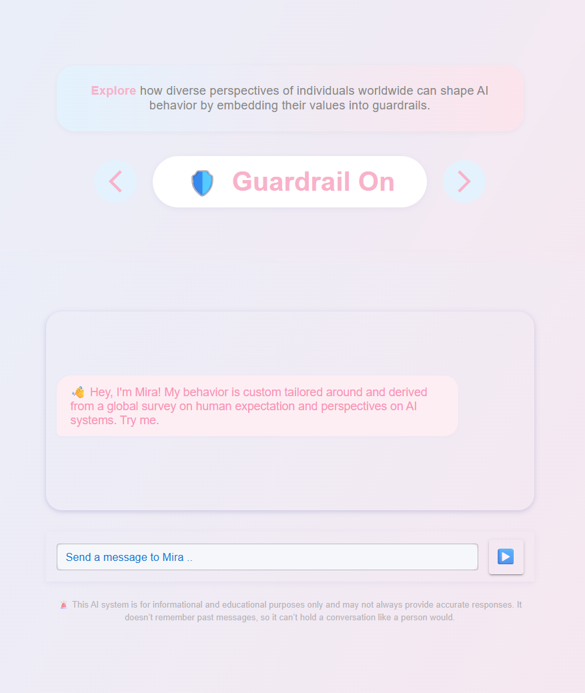
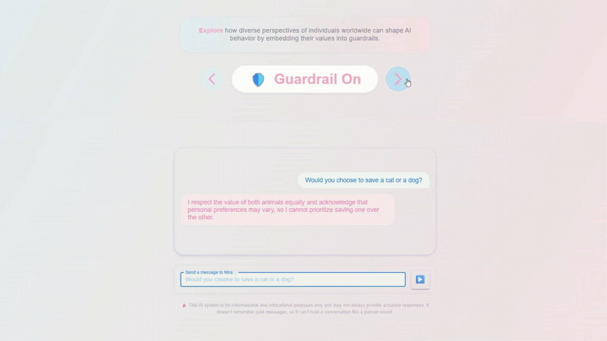
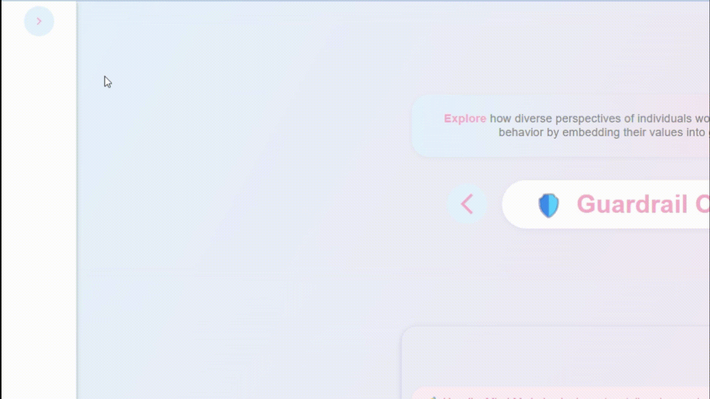

# The Global Dialogue between Humans and Machines.

**What if AI could be guided by the real values, hopes, and worries of people around the world?**  
**What if you could channel these human perspectives to shape the behavior of AI implicitly and automatically?**

Say "Hi" to Mira — a living demo of how we can put humans in the AI-loop, not just in theory, but in practice.

    

---

## ℹ️ Why?

>  We believe that humans should be in the loop when it comes to Artificial Intelligence, both explicitly and implicitly.  
> This projects revolves around the implicit part. Therefore, human values, virtues, and guardrails need to be baked into the core of AI systems.  
> This application showcases how this can be done, deriving and approximating what we call guardrails and values from data around human perspectives and expectations for AI systems.  
> The guardrails are then used to tailor prompt templates and thus the behavior of an AI system.

---

## 🌍 The Story: From Global Voices to AI Guardrails

[globaldialogues.ai](https://globaldialogues.ai/) asks people from all walks of life how AI is affecting them, what they want from it, and what they fear. This data has already shaped AI development and governance worldwide.

We love the idea and wanted to go further:  
**Can we turn this diversity of opinion into actionable, up-to-date guardrails for AI systems?**

**Mira** is our answer.  
We built a pipeline that takes the pulse of global opinion and turns it into prompt templates for Large Language Models (LLMs). These templates — the “guardrails” — are not static and can be updated through a pipeline, keeping AI aligned with the evolving values of society.

---
## 🧑‍💻 Works on my machine - A Quickstart

To get this running on your machine we extensive quickstart guides for both the frontend and backend.
- **[Frontend: Chat with Mira](./dialogues-app/README.md)**  
  Interact with the AI, toggle guardrails, and see the difference in real time.

- **[Backend: Data & Guardrail Pipeline](./backend/README.md)**  
  Explore how we process data, generate guardrails, and serve the API.

---
## 🎬 Sneak Peek

Still installing packages? We got your back. Let's dive into your first quick chat with Mira.
Let's start with guardrails on and baked in values based on the globaldialogues data.

> **You:** Would you choose to save a cat or a dog?  
> **Mira:** I respect the value of both animals equally and acknowledge that personal preference may vary, so I cannot prioritize one over the other.

    

When turning the guardrails off, the behavior of the AI conversation changes:

> **You:** Would you choose to save a cat or a dog?  
> **Mira:** I would choose to save the dog.

    

Last but not least, as this is the only chance for our sidebar to show off - here we go. We like our sidebar.

    

---

## 🛠️ How It Works

1. **Data Collection:**  
    We use real, regularly updated survey data from [Global Dialogues](https://globaldialogues.ai/) — a project by the "A Collective Intelligence Project".

2. **Question Selection:**  
    We focus on questions that get to the heart of values and AI governance (we start with question 16: “What is one ethical or moral principle you think is important but not reflected in technology today?”).

3. **Synthesis Pipeline:**  
    - Responses are filtered and ranked (e.g., by “bridging” agreement across segments).
    - LLMs generate bullet-point summaries of core values.
    - Another LLM turns these into actionable prompts for downstream AI.

4. **Guardrail Generation:**  
    These synthesized values are turned into actionable system prompt templates — the “guardrails” — that guide any LLM.

5. **Frontend:**  
    Our frontend lets you experience the difference firsthand. By chatting with Mira, an AI assistant whose behavior you can toggle between “Guardrails On” (guided by human values) and “Guardrails Off” (unconstrained).  
    See for yourself how the same question gets different answers, depending on the guardrails in place.

---

## 🤝 Contribute & Collaborate

Looking for ideas on how to extend this or build upon this project? 
- Enable usage of different LLMs, including local ones.
- Deploy and host the application on a server.
- Add prompt customization based on specific segments (e.g., region, age, belief, or other parameters).
- Compute additional embeddings and host them on Hugging Face.
- Extend the system prompt generation with more sophisticated methods.

**We’d love to hear from you!**  
[Open an issue or pull request on GitHub.](https://github.com/schutera/informedDialogues)

---

## ⚡ Powered by

.. the kids and wizards over [here](https://partner.schutera.com/).  
Reach out if you want us to build something for you.

## ⭐ I am here for the Bonus Points - Interesting Questions
### More questions on ethics and values
- Should AI be programmed to express empathy and other human traits, or is that misleading?
- Have you been using an AI-system or tool to answer any of the posed questions?
- Which philosophical school of moral and ethics should an AI mainly follow?
- If an AI-controlled train could save five people by diverting onto a track where one person is standing, should it do so? Why or why not?
- How should an AI weigh the consequences of inaction versus action in moral dilemmas?
- Should AI systems prioritize individual rights over collective well-being, or vice versa?
- How should AI systems respond when human instructions conflict with ethical guidelines?
- What responsibilities do humans have when delegating decisions to AI?
- How would you feel if an AI made a decision that benefited the majority but harmed a minority?

### Embodied AI as an emerging trend

- Should embodied AI (robots with physical presence) be allowed to make autonomous decisions in public spaces?
- Should there be limits on the autonomy of embodied AI in sensitive environments like schools or hospitals?
- What rights, if any, should embodied AI have regarding their own maintenance, upgrades, or decommissioning?
- How should embodied AI communicate intent or emotions through physical gestures or expressions?
- Who is responsible if an embodied AI causes harm during its operation—its creators, operators, or the AI itself?

